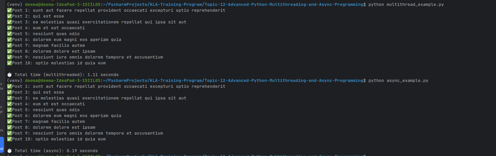

# Performance Comparison – Multithreading vs AsyncIO in Python

## Overview
This experiment compares the performance of two different concurrency models in Python:
- `ThreadPoolExecutor` with the `requests` library (multithreading)
- `asyncio` with `aiohttp` (asynchronous)

Each implementation makes **10 API calls** to:  
`https://jsonplaceholder.typicode.com/posts/{id}`

---

## Test Setup

- Machine: Local development environment
- Number of API requests: 10
- Endpoint: Free public REST API (jsonplaceholder)
- Requests made in parallel (threads or async coroutines)
- Timeout: 5 seconds

---

## Execution Results

| Method              | Library Used           | Runtime (seconds) |
|---------------------|------------------------|-------------------|
| ThreadPoolExecutor  | `requests`             | 1.11              |
| asyncio + aiohttp   | `aiohttp` + `asyncio`  | 0.19              |

---

## Analysis

- **ThreadPoolExecutor** runs synchronous HTTP requests in parallel using multiple threads.
  - Good for working with blocking I/O libraries like `requests`
  - Threads can scale for small workloads but become inefficient at large scale due to context switching

- **AsyncIO + aiohttp** is non-blocking and event-driven.
  - All requests are initiated simultaneously and resolved as data is received
  - Much more scalable and lightweight for I/O-bound workloads

---

## Conclusion

- Use **asyncio + aiohttp** for:
  - Many simultaneous network calls
  - Efficient CPU and memory usage
  - Real-time applications (chat, APIs, monitoring)

- Use **ThreadPoolExecutor** for:
  - Integrating with blocking libraries like `requests`
  - Migrating legacy codebases

---

## Final Thoughts

- Async is faster and more scalable, but slightly harder to learn.
- For modern Python projects with a lot of HTTP calls, **asyncio is the recommended approach**.

